### Chức năng
1. Landing page giới thiệu hệ thống
2. Đăng nhập, Đăng ký, đăng xuất.
3. Đăng ký gửi xác thực về email.
4. Đăng nhập sử dụng tài khoản Google (trường hợp đã liên kết với tài khoản Google).
5. Quên mật khẩu gửi mã OTP về email (trường hợp đã liên kết với tài khoản Google).
6. Cho phép người dùng cập nhật hồ sơ.
7. Thêm, xóa, chỉnh sửa câu hỏi, văn bản, lớp, văn bản luyện tập,người dùng.
8. Sinh viên tham gia nhóm học phần bằng mã mời.
9. Sinh viên thực hiện các bài kiểm tra được được giao.
10. Xuất báo cáo kết quả thi tất cả các bài kiểm tra.
11. Giới hạn thời gian bắt đầu và thời gian kết thúc đề thi.
12. Sinh viên có thể xem lại bài thi của mình.
13. Thống kê điểm số của sinh viên tham gia đề thi.
14. Lọc điểm số của sinh viên ở từng đề kiểm tra

### Giao diện

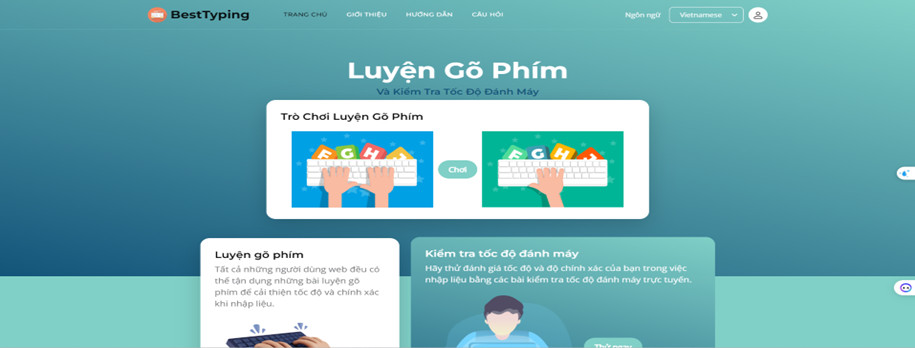

<h4 align="center">Giao diện trang chủ</h4>

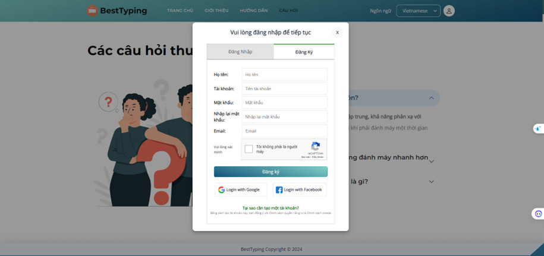

<h4 align="center">Đăng ký</h4>

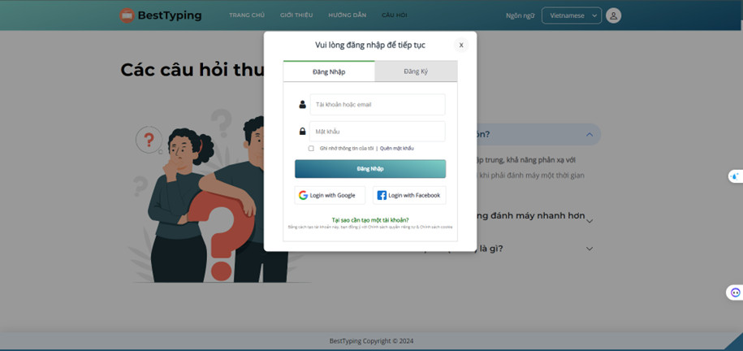

<h4 align="center">Đăng ký</h4>

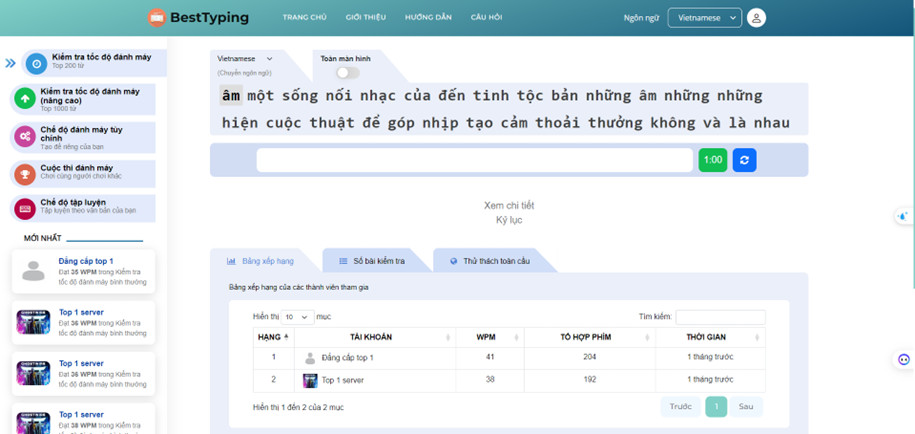

<h4 align="center">Chế độ cơ bản</h4>

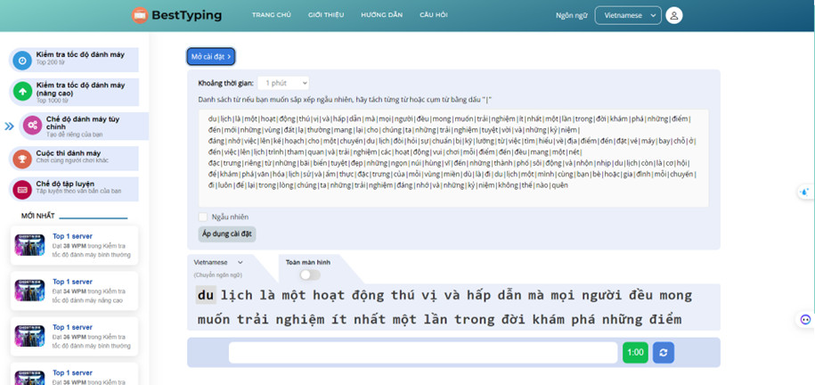

<h4 align="center">Chế độ custom</h4>

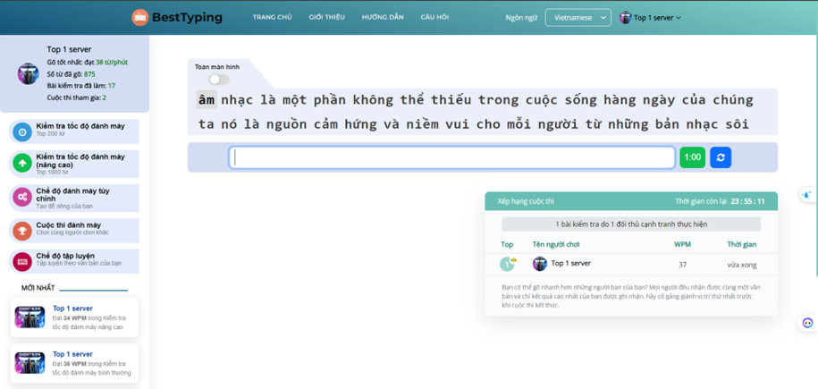

<h4 align="center">Chế độ cuộc thi đánh máy</h4>

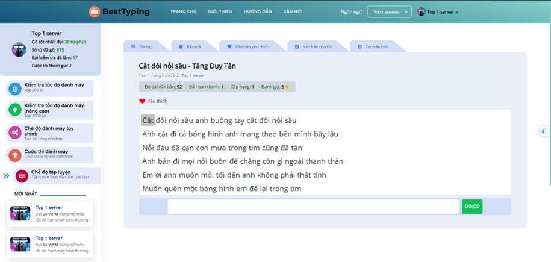

<h4 align="center">Chế độ luyện tập</h4>

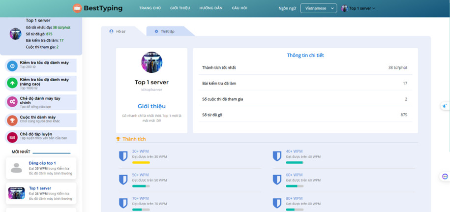

<h4 align="center">Thông tin người dùng</h4>

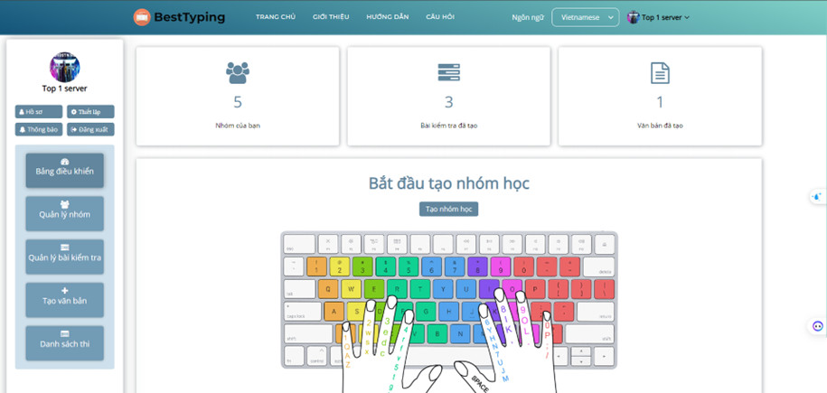

<h4 align="center">Giao diện cho giảng viên</h4>

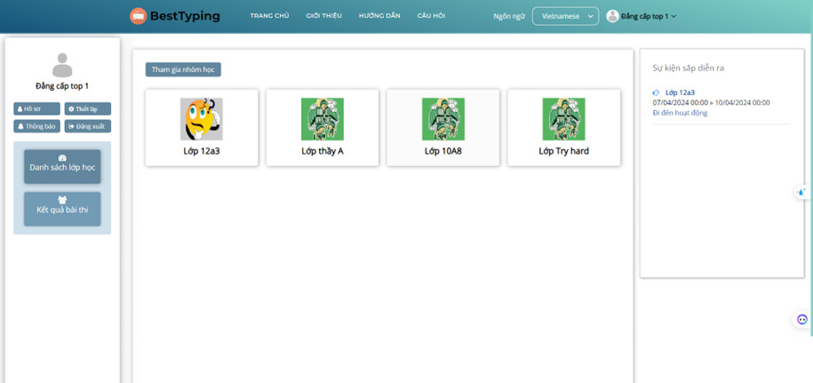

<h4 align="center">Giao diện cho học sinh</h4>

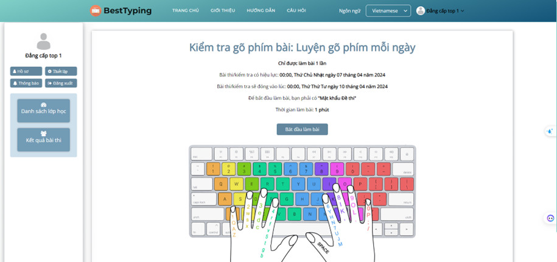

<h4 align="center">Giao diện thực hiện bài thi</h4>
